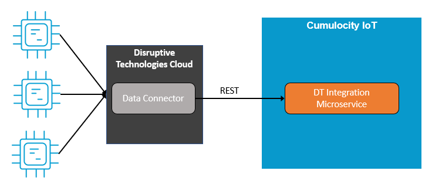
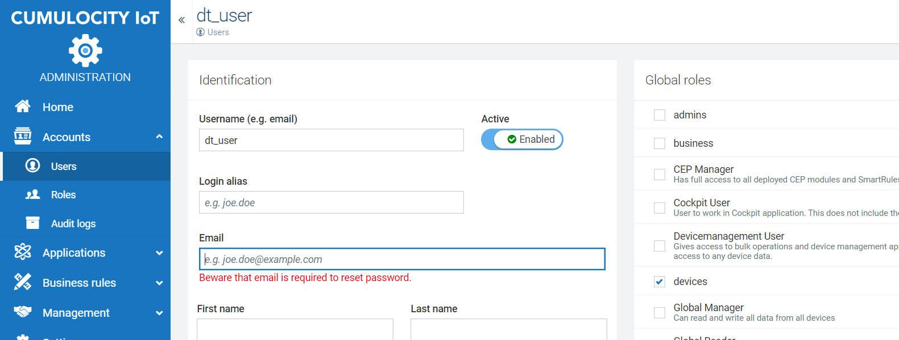
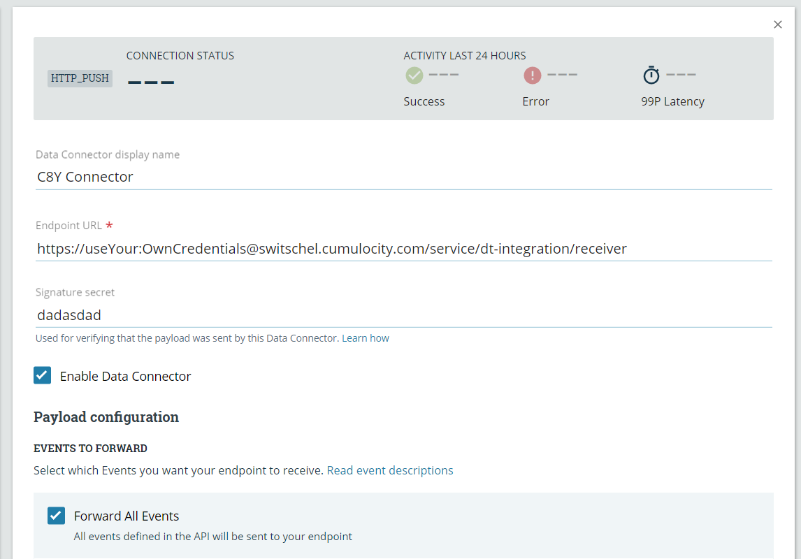
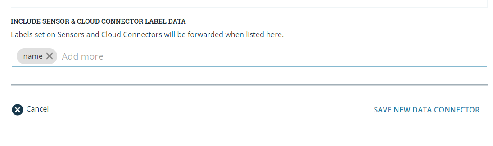
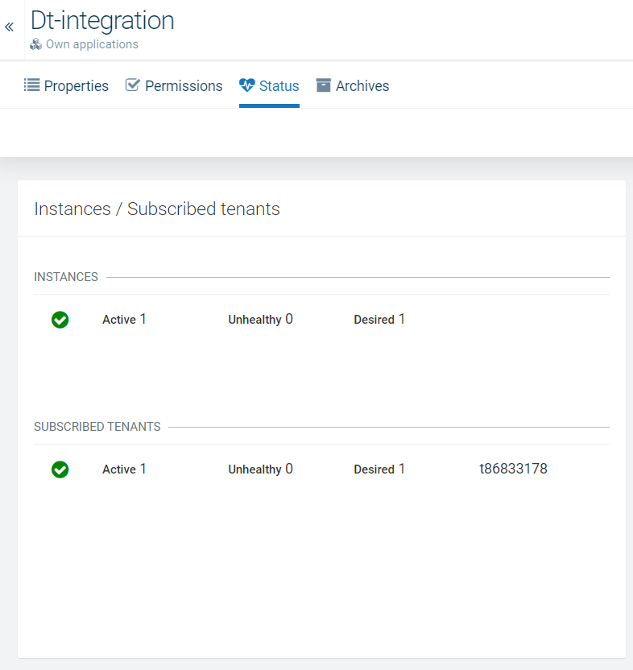

# Cumulocity Integration Microservice for Disruptive Technologies

## Description
This is a Microservice that allows Receiving, Mapping and Transport of [Disruptive Technologies](https://www.disruptive-technologies.com/) Device Messages to Cumulocity.
The integration is a cloud-to-cloud integration with a Server Side Agent running within Cumulocity as a Microservice.
The "Data Connectors" of Disruptive Technologies (DT) are used to forward data via REST to the endpoint provided by the Microservice.

The [Cumulocity Microservice SDK](https://cumulocity.com/guides/microservice-sdk/introduction/) version 1005.1.0 in combination with Java 8 + Spring Boot 1.5 are used.

## Prerequisites

- A Cumulocity Tenant with Admin Privileges and Microservice Deployment Feature. You can request a free trial [here](https://cumulocity.com/try-cumulocity-free/).
- Access to the DT Studio. This requires to purchase a [Sensor Pilot Kit](https://www.disruptive-technologies.com/pilot-kit/) to get access.

## Preparations & Setup
1. In Cumulocity go to Administration -> Users and create a new User with the assigned Role `devices`. Make sure you set the password directly by unchecking "Send password reset link as email"

    
    
2. Log in to the [DT Studio](https://studio.disruptive-technologies.com) with the credentials provided by DT.
3. In the Navigation Pane on the left click on "Data Connectors" and create a new one.
4. Enter the following by replacing `<c8yUser>`,`<c8yPassword>` and `<c8yTenant>` with the credentials.
    - Name: `C8Y Connector`
    - Endpoint URL: `https://<c8yUser>:<c8yPassword>@<c8yTenant>.cumulocity.com/service/dt-integration/receiver`
    - Signature Secret: `<anySecretKey>`
    
    
    
5. Keep "Forward All Events" checked
6. In "Include Sensor & Cloud Connector Label Data" add `name`

    
    
7. Save the Data Connector

## Microservice Configuration
Make sure you enter your the following Properties in the `application.properties` file:
- `C8Y.baseURL` - URL to your Tenant and Cumulocity Instance
- `dt.secret` - Your Connector Secret. See [Prerequisites](#prerequisites)

## Build
Make sure that [Docker](https://www.docker.com/) and [Apache Maven](https://maven.apache.org/) are installed and running on your Computer.
Run `mvn clean package` to build the Microservice which will create a ZIP archive you can upload to Cumulocity.

## Deploy
1. Login to your Cumulocity Tenant. Go to Administration -> Applications. Click on "Add Application" and "Upload Microservice".
2. Select the zip archive generated by the [Build](#build).
    > NOTE: Rename the zip archive to "dt-integration.zip" before uploading it
3. Wait until the Microservice is uploaded and started. You can check that under the application and Status.

## Devices in Cumulocity
The Devices will be created by using the label `name` of the Disruptive Tech.
All Data incoming will be created as Event on the Device with the Name `
DT Logging Device`.

Dependant on the type of the Device it will have Events "Object opened" and "Object closed" or Measurements like Temperature etc.
All of them have Measurements `Battery`,  `Daily Counter` and `Signal Strength`.
The Daily Counter counts the received "Object opened/closed" Events per Day.

You can use them to create your own Dashboards, Smart Rules, Apama Rules.
______________________
These tools are provided as-is and without warranty or support. They do not constitute part of the Software AG product suite. Users are free to use, fork and modify them, subject to the license agreement. While Software AG welcomes contributions, we cannot guarantee to include every contribution in the master project.	
______________________
For more information you can Ask a Question in the [TECHcommunity Forums](http://tech.forums.softwareag.com/techjforum/forums/list.page?product=cumulocity).

You can find additional information in the [Software AG TECHcommunity](http://techcommunity.softwareag.com/home/-/product/name/cumulocity).

_________________
Contact us at [TECHcommunity](mailto:technologycommunity@softwareag.com?subject=Github/SoftwareAG) if you have any questions.
